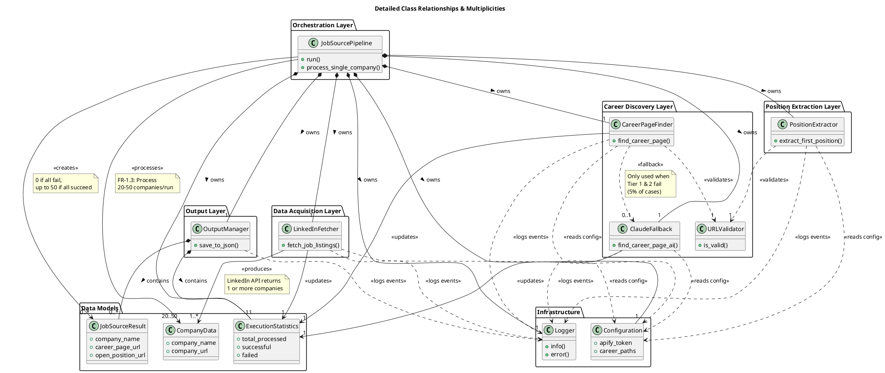
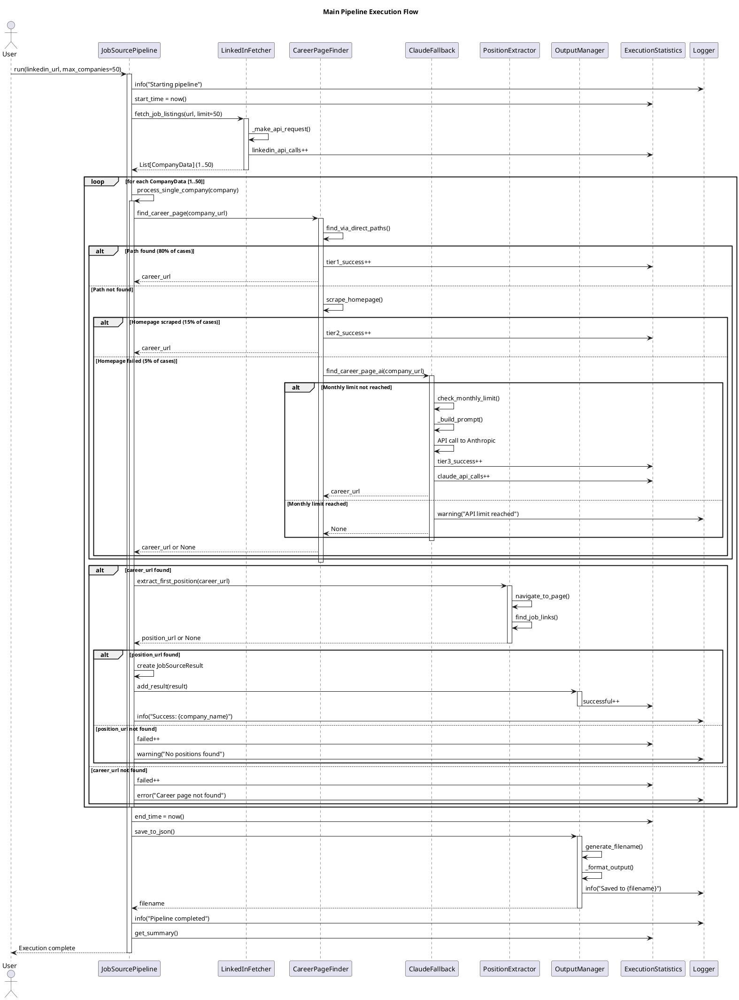
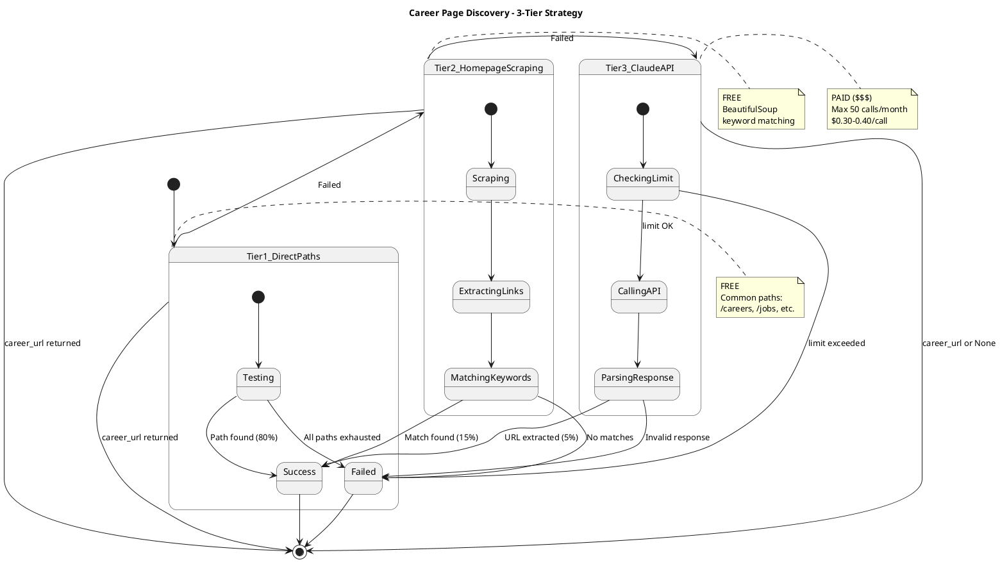
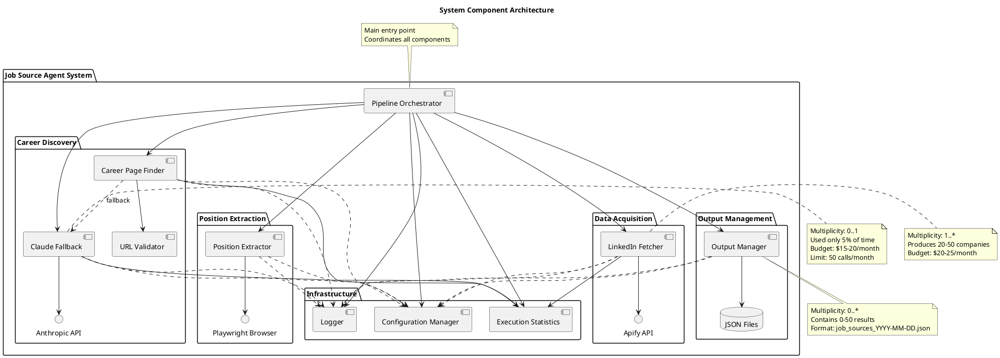

# Design Phase - Step 2: UML Class Diagrams
## AI Job Source Agent

**Version:** 1.0  
**Date:** 2025-02-13

---

## UML NOTATION LEGEND

```
Relationships:
──────────>    Association (uses)
──────────▷    Dependency (depends on)
◆──────────    Composition (owns, lifecycle bound)
◇──────────    Aggregation (has-a, independent lifecycle)
──────────▷    Inheritance (is-a)

Multiplicities:
1          Exactly one
0..1       Zero or one
*          Zero or many
1..*       One or many
n          Specific number

Visibility:
+          Public
-          Private
#          Protected
```

---

## DIAGRAM 1: COMPLETE CLASS DIAGRAM

```plantuml
@startuml AI_Job_Source_Agent_Complete

' ============ CONFIGURATION & UTILITIES ============
class Configuration {
    - apify_token: str
    - anthropic_api_key: str
    - career_paths: List[str]
    - career_keywords: List[str]
    - max_claude_calls: int
    - request_timeout: int
    - browser_timeout: int
    - output_dir: str
    __
    + load_from_env(): void
    + validate(): bool
    + get(key: str): Any
}

class Logger {
    - log_file: str
    - log_level: str
    - logs: List[Dict]
    __
    + info(message: str): void
    + error(message: str, exception: Exception): void
    + warning(message: str): void
    + save_logs(): void
}

class URLValidator {
    - timeout: int
    - user_agent: str
    __
    + is_valid(url: str): bool
    + normalize(url: str): str
    + make_absolute(base: str, relative: str): str
    - _check_status(url: str): int
}

' ============ DATA MODELS ============
class CompanyData {
    + company_name: str
    + company_url: str
    + linkedin_job_url: str
    + job_title: str
    __
    + to_dict(): Dict
    + validate_url(): bool
}

class JobSourceResult {
    + company_name: str
    + career_page_url: str
    + open_position_url: str
    + timestamp: datetime
    + source_tier: int
    + processing_time: float
    __
    + to_dict(): Dict
    + validate(): bool
    + __repr__(): str
}

class ExecutionStatistics {
    + total_processed: int
    + successful: int
    + failed: int
    + tier1_success: int
    + tier2_success: int
    + tier3_success: int
    + claude_api_calls: int
    + linkedin_api_calls: int
    + total_processing_time: float
    + start_time: datetime
    + end_time: datetime
    __
    + increment_success(tier: int): void
    + increment_failure(): void
    + calculate_success_rate(): float
    + calculate_heuristic_success_rate(): float
    + to_dict(): Dict
    + get_summary(): str
}

' ============ CORE COMPONENTS ============
class LinkedInFetcher {
    - api_token: str
    - base_url: str
    - max_items: int
    - request_timeout: int
    - api_calls_made: int
    - monthly_budget: float
    __
    + fetch_job_listings(linkedin_url: str, limit: int): List[Dict]
    + extract_company_data(raw_response: Dict): List[CompanyData]
    + handle_rate_limit(response: Dict): bool
    + validate_api_response(response: Dict): bool
    - _make_api_request(endpoint: str, params: Dict): Dict
    - _track_api_cost(items_fetched: int): void
}

class CareerPageFinder {
    - common_paths: List[str]
    - career_keywords: List[str]
    - request_timeout: int
    - max_retries: int
    - tier1_success_count: int
    - tier2_success_count: int
    - tier3_success_count: int
    __
    + find_career_page(company_url: str): Optional[str]
    + find_via_direct_paths(company_url: str): Optional[str]
    + scrape_homepage(company_url: str): Optional[str]
    + check_footer_nav(soup: BeautifulSoup): Optional[str]
    + make_absolute_url(base_url: str, relative_url: str): str
    + validate_url(url: str): bool
    - _matches_career_keyword(text: str, url: str): bool
    - _is_valid_career_page(url: str, content: str): bool
}

class ClaudeFallback {
    - api_key: str
    - model: str
    - max_tokens: int
    - calls_this_month: int
    - max_calls_per_month: int
    - monthly_budget: float
    __
    + find_career_page_ai(company_url: str): Optional[str]
    + check_monthly_limit(): bool
    + increment_call_counter(): void
    - _build_prompt(company_url: str): str
    - _parse_claude_response(response: Dict): Optional[str]
}

class PositionExtractor {
    - browser_timeout: int
    - page_load_timeout: int
    - job_selectors: List[str]
    - headless: bool
    - browser_context: BrowserContext
    __
    + extract_first_position(career_page_url: str): Optional[str]
    + navigate_to_page(url: str): Page
    + find_job_links(page: Page): List[str]
    + make_absolute_url(base_url: str, job_url: str): str
    - _initialize_browser(): Browser
    - _wait_for_content(page: Page): void
    - _extract_job_url(element: ElementHandle): str
}

class OutputManager {
    - output_dir: str
    - filename_template: str
    - results: List[JobSourceResult]
    - statistics: ExecutionStatistics
    __
    + add_result(result: JobSourceResult): void
    + save_to_json(filename: str): str
    + generate_filename(): str
    - _format_output(): Dict
    - _ensure_output_dir(): void
}

class JobSourcePipeline {
    - config: Configuration
    - linkedin_fetcher: LinkedInFetcher
    - career_finder: CareerPageFinder
    - claude_fallback: ClaudeFallback
    - position_extractor: PositionExtractor
    - output_manager: OutputManager
    - statistics: ExecutionStatistics
    - logger: Logger
    __
    + run(linkedin_url: str, max_companies: int): void
    + process_single_company(company: CompanyData): Optional[JobSourceResult]
    + handle_error(error: Exception, company: CompanyData): void
    - _initialize_components(): void
    - _validate_inputs(linkedin_url: str, max_companies: int): bool
    - _print_progress(current: int, total: int): void
}

' ============ RELATIONSHIPS ============

' Pipeline Composition (owns components)
JobSourcePipeline *-- "1" Configuration : owns
JobSourcePipeline *-- "1" LinkedInFetcher : owns
JobSourcePipeline *-- "1" CareerPageFinder : owns
JobSourcePipeline *-- "1" ClaudeFallback : owns
JobSourcePipeline *-- "1" PositionExtractor : owns
JobSourcePipeline *-- "1" OutputManager : owns
JobSourcePipeline *-- "1" ExecutionStatistics : owns
JobSourcePipeline *-- "1" Logger : owns

' OutputManager Composition
OutputManager *-- "0..*" JobSourceResult : contains
OutputManager *-- "1" ExecutionStatistics : contains

' Dependencies - Components use Configuration
LinkedInFetcher ..> Configuration : uses
CareerPageFinder ..> Configuration : uses
ClaudeFallback ..> Configuration : uses
PositionExtractor ..> Configuration : uses
OutputManager ..> Configuration : uses

' Dependencies - Components use Logger
LinkedInFetcher ..> Logger : logs to
CareerPageFinder ..> Logger : logs to
ClaudeFallback ..> Logger : logs to
PositionExtractor ..> Logger : logs to
OutputManager ..> Logger : logs to

' CareerPageFinder uses URLValidator
CareerPageFinder ..> URLValidator : uses
PositionExtractor ..> URLValidator : uses

' CareerPageFinder fallback to ClaudeFallback
CareerPageFinder --> "0..1" ClaudeFallback : fallback to

' Data flow associations
LinkedInFetcher --> "1..*" CompanyData : produces
JobSourcePipeline --> "1..*" CompanyData : processes
JobSourcePipeline --> "0..*" JobSourceResult : creates

' Statistics tracking
LinkedInFetcher --> ExecutionStatistics : updates
CareerPageFinder --> ExecutionStatistics : updates
ClaudeFallback --> ExecutionStatistics : updates

@enduml
```



---

## DIAGRAM 2: DETAILED RELATIONSHIP DIAGRAM



---

## DIAGRAM 3: INTERACTION SEQUENCE DIAGRAM



---

## DIAGRAM 4: CAREER FINDER STATE MACHINE



---

## DIAGRAM 5: COMPONENT DIAGRAM



---

## KEY RELATIONSHIP SUMMARY

### 1. COMPOSITION (◆──) - Strong Ownership

| Owner | Owns | Multiplicity | Lifecycle |
|-------|------|--------------|-----------|
| JobSourcePipeline | LinkedInFetcher | 1 | Bound |
| JobSourcePipeline | CareerPageFinder | 1 | Bound |
| JobSourcePipeline | ClaudeFallback | 1 | Bound |
| JobSourcePipeline | PositionExtractor | 1 | Bound |
| JobSourcePipeline | OutputManager | 1 | Bound |
| JobSourcePipeline | Configuration | 1 | Bound |
| JobSourcePipeline | Logger | 1 | Bound |
| JobSourcePipeline | ExecutionStatistics | 1 | Bound |
| OutputManager | JobSourceResult | 0..* | Bound |
| OutputManager | ExecutionStatistics | 1 | Bound |

**Meaning:** Pipeline creates and destroys these components. They cannot exist independently.

---

### 2. ASSOCIATION (──) - Uses Relationship

| Client | Uses | Multiplicity | Direction | Notes |
|--------|------|--------------|-----------|-------|
| LinkedInFetcher | CompanyData | 1..* | produces | Returns 1+ companies |
| JobSourcePipeline | CompanyData | 20..50 | processes | FR-1.3 requirement |
| JobSourcePipeline | JobSourceResult | 0..* | creates | 0 if all fail, max 50 |
| CareerPageFinder | ExecutionStatistics | 1 | updates | Tier success counters |
| ClaudeFallback | ExecutionStatistics | 1 | updates | API call tracking |

**Meaning:** These are primary data flows through the system.

---

### 3. DEPENDENCY (- - ->) - Temporary Usage

| Client | Depends On | Multiplicity | Condition | Frequency |
|--------|-----------|--------------|-----------|-----------|
| CareerPageFinder | ClaudeFallback | 0..1 | When Tier 1&2 fail | 5% of time |
| CareerPageFinder | URLValidator | 1 | Always | Every validation |
| PositionExtractor | URLValidator | 1 | Always | Every validation |
| All Components | Configuration | 1 | Initialization | Once at startup |
| All Components | Logger | 1 | On events | Throughout execution |

**Meaning:** Temporary, conditional, or utility relationships.

---

### 4. CRITICAL MULTIPLICITIES

#### Input Multiplicity (FR-1.3):
```
User Input → Pipeline: 1 (single LinkedIn URL)
Pipeline → Companies: 20..50 (process this many)
```

#### Processing Multiplicity:
```
LinkedIn API → CompanyData: 1..* (at least one)
CareerPageFinder → career_url: 0..1 (found or not)
PositionExtractor → position_url: 0..1 (found or not)
Pipeline → JobSourceResult: 0..* (0 to max_companies)
```

#### Tier Strategy Multiplicity:
```
CareerPageFinder → Tier1: 1 (always try)
CareerPageFinder → Tier2: 0..1 (if Tier1 fails)
CareerPageFinder → Tier3: 0..1 (if Tier1&2 fail, max 50/month)
```

#### Output Multiplicity:
```
OutputManager → JobSourceResult: 0..* (collected results)
OutputManager → JSON file: 1 (single output file)
```

---

## DESIGN PATTERNS IN RELATIONSHIPS

### 1. Strategy Pattern
```
CareerPageFinder
    ↓ uses
[Tier1Strategy] [Tier2Strategy] [Tier3Strategy(ClaudeFallback)]
```
**Relationship:** Dependency with conditional selection

### 2. Facade Pattern
```
User → JobSourcePipeline → [All Subsystems]
```
**Relationship:** JobSourcePipeline owns and orchestrates all components

### 3. Singleton Pattern
```
All Components → Configuration (shared instance)
All Components → Logger (shared instance)
```
**Relationship:** Dependency on shared resources

---

## RELATIONSHIP CONSTRAINTS

### Temporal Constraints:
1. **Configuration** must be initialized before any component
2. **Logger** must be available before any logging occurs
3. **LinkedInFetcher** executes before **CareerPageFinder**
4. **CareerPageFinder** executes before **PositionExtractor**
5. **OutputManager** executes after all processing complete

### Cardinality Constraints:
1. **JobSourcePipeline** has exactly 1 of each component
2. **CompanyData** produced: minimum 1, maximum 50
3. **JobSourceResult** produced: minimum 0, maximum 50
4. **ClaudeFallback** calls: maximum 50 per month
5. **OutputManager** creates exactly 1 JSON file per run

### Dependency Constraints:
1. **CareerPageFinder** depends on **URLValidator** (mandatory)
2. **CareerPageFinder** depends on **ClaudeFallback** (optional)
3. All components depend on **Configuration** (mandatory)
4. All components depend on **Logger** (optional but recommended)

---

**DIAGRAMS GENERATED:**
1. ✓ Complete Class Diagram (all 12 classes)
2. ✓ Detailed Relationship Diagram (with multiplicities)
3. ✓ Sequence Diagram (main execution flow)
4. ✓ State Machine (Career Finder tiers)
5. ✓ Component Diagram (system architecture)

**NEXT STEP:** Review diagrams and proceed to implementation phase or refine design.
