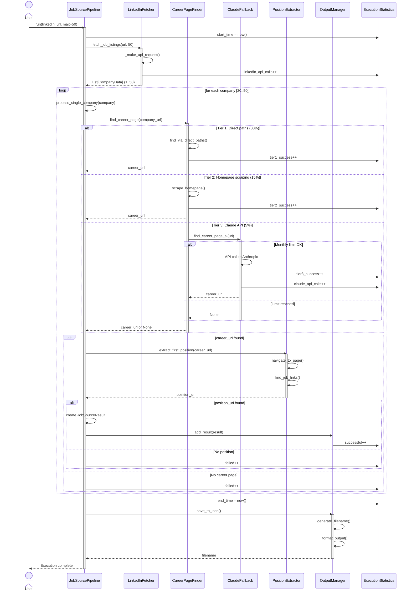
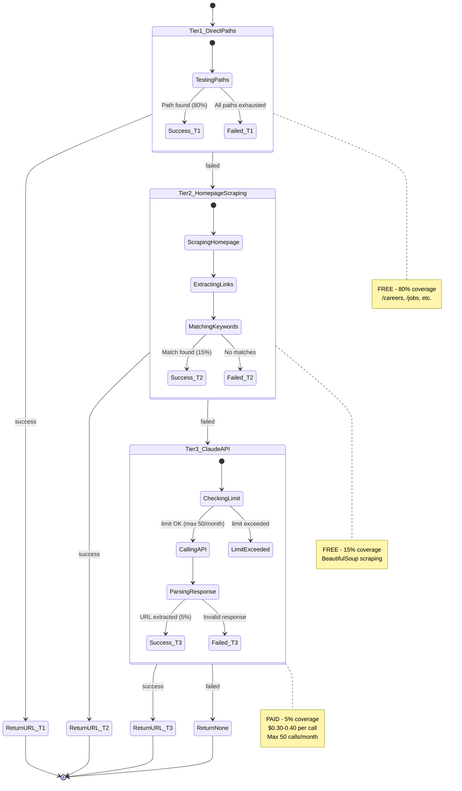
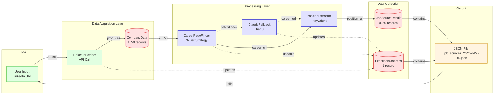

# UML Diagrams - Mermaid Format
## AI Job Source Agent

**Note:** These diagrams render directly in GitHub, GitLab, and compatible markdown viewers.

---

## DIAGRAM 1: Complete Class Diagram

```mermaid
classDiagram
    %% ============ INFRASTRUCTURE ============
    class Configuration {
        -string apifyToken
        -string anthropicApiKey
        -List~string~ careerPaths
        -List~string~ careerKeywords
        -int maxClaudeCalls
        -int requestTimeout
        -int browserTimeout
        -string outputDir
        +loadFromEnv() void
        +validate() bool
        +get(key) Any
    }

    class Logger {
        -string logFile
        -string logLevel
        -List~Dict~ logs
        +info(message) void
        +error(message, exception) void
        +warning(message) void
        +saveLogs() void
    }

    class URLValidator {
        -int timeout
        -string userAgent
        +isValid(url) bool
        +normalize(url) string
        +makeAbsolute(base, relative) string
        -checkStatus(url) int
    }

    %% ============ DATA MODELS ============
    class CompanyData {
        +string companyName
        +string companyUrl
        +string linkedinJobUrl
        +string jobTitle
        +toDict() Dict
        +validateUrl() bool
    }

    class JobSourceResult {
        +string companyName
        +string careerPageUrl
        +string openPositionUrl
        +datetime timestamp
        +int sourceTier
        +float processingTime
        +toDict() Dict
        +validate() bool
        +repr() string
    }

    class ExecutionStatistics {
        +int totalProcessed
        +int successful
        +int failed
        +int tier1Success
        +int tier2Success
        +int tier3Success
        +int claudeApiCalls
        +int linkedinApiCalls
        +float totalProcessingTime
        +datetime startTime
        +datetime endTime
        +incrementSuccess(tier) void
        +incrementFailure() void
        +calculateSuccessRate() float
        +calculateHeuristicSuccessRate() float
        +toDict() Dict
        +getSummary() string
    }

    %% ============ CORE COMPONENTS ============
    class LinkedInFetcher {
        -string apiToken
        -string baseUrl
        -int maxItems
        -int requestTimeout
        -int apiCallsMade
        -float monthlyBudget
        +fetchJobListings(url, limit) List~Dict~
        +extractCompanyData(response) List~CompanyData~
        +handleRateLimit(response) bool
        +validateApiResponse(response) bool
        -makeApiRequest(endpoint, params) Dict
        -trackApiCost(items) void
    }

    class CareerPageFinder {
        -List~string~ commonPaths
        -List~string~ careerKeywords
        -int requestTimeout
        -int maxRetries
        -int tier1SuccessCount
        -int tier2SuccessCount
        -int tier3SuccessCount
        +findCareerPage(companyUrl) string
        +findViaDirectPaths(companyUrl) string
        +scrapeHomepage(companyUrl) string
        +checkFooterNav(soup) string
        +makeAbsoluteUrl(base, relative) string
        +validateUrl(url) bool
        -matchesCareerKeyword(text, url) bool
        -isValidCareerPage(url, content) bool
    }

    class ClaudeFallback {
        -string apiKey
        -string model
        -int maxTokens
        -int callsThisMonth
        -int maxCallsPerMonth
        -float monthlyBudget
        +findCareerPageAi(companyUrl) string
        +checkMonthlyLimit() bool
        +incrementCallCounter() void
        -buildPrompt(companyUrl) string
        -parseClaudeResponse(response) string
    }

    class PositionExtractor {
        -int browserTimeout
        -int pageLoadTimeout
        -List~string~ jobSelectors
        -bool headless
        -BrowserContext browserContext
        +extractFirstPosition(careerPageUrl) string
        +navigateToPage(url) Page
        +findJobLinks(page) List~string~
        +makeAbsoluteUrl(base, jobUrl) string
        -initializeBrowser() Browser
        -waitForContent(page) void
        -extractJobUrl(element) string
    }

    class OutputManager {
        -string outputDir
        -string filenameTemplate
        -List~JobSourceResult~ results
        -ExecutionStatistics statistics
        +addResult(result) void
        +saveToJson(filename) string
        +generateFilename() string
        -formatOutput() Dict
        -ensureOutputDir() void
    }

    class JobSourcePipeline {
        -Configuration config
        -LinkedInFetcher linkedinFetcher
        -CareerPageFinder careerFinder
        -ClaudeFallback claudeFallback
        -PositionExtractor positionExtractor
        -OutputManager outputManager
        -ExecutionStatistics statistics
        -Logger logger
        +run(linkedinUrl, maxCompanies) void
        +processSingleCompany(company) JobSourceResult
        +handleError(error, company) void
        -initializeComponents() void
        -validateInputs(url, max) bool
        -printProgress(current, total) void
    }

    %% ============ RELATIONSHIPS ============
    
    %% Composition - Pipeline owns components
    JobSourcePipeline *-- "1" Configuration : owns
    JobSourcePipeline *-- "1" LinkedInFetcher : owns
    JobSourcePipeline *-- "1" CareerPageFinder : owns
    JobSourcePipeline *-- "1" ClaudeFallback : owns
    JobSourcePipeline *-- "1" PositionExtractor : owns
    JobSourcePipeline *-- "1" OutputManager : owns
    JobSourcePipeline *-- "1" ExecutionStatistics : owns
    JobSourcePipeline *-- "1" Logger : owns

    %% Composition - OutputManager contains
    OutputManager *-- "0..*" JobSourceResult : contains
    OutputManager *-- "1" ExecutionStatistics : contains

    %% Dependencies - use Configuration
    LinkedInFetcher ..> Configuration : uses
    CareerPageFinder ..> Configuration : uses
    ClaudeFallback ..> Configuration : uses
    PositionExtractor ..> Configuration : uses
    OutputManager ..> Configuration : uses

    %% Dependencies - use Logger
    LinkedInFetcher ..> Logger : logs to
    CareerPageFinder ..> Logger : logs to
    ClaudeFallback ..> Logger : logs to
    PositionExtractor ..> Logger : logs to
    OutputManager ..> Logger : logs to

    %% Dependencies - use URLValidator
    CareerPageFinder ..> URLValidator : uses
    PositionExtractor ..> URLValidator : uses

    %% Association - CareerPageFinder fallback
    CareerPageFinder --> "0..1" ClaudeFallback : fallback to

    %% Association - Data production
    LinkedInFetcher --> "1..*" CompanyData : produces
    JobSourcePipeline --> "20..50" CompanyData : processes
    JobSourcePipeline --> "0..*" JobSourceResult : creates

    %% Association - Statistics updates
    LinkedInFetcher --> ExecutionStatistics : updates
    CareerPageFinder --> ExecutionStatistics : updates
    ClaudeFallback --> ExecutionStatistics : updates
```



---

## DIAGRAM 2: Simplified Relationship Focus

```mermaid
graph TB
    subgraph "Orchestration"
        Pipeline[JobSourcePipeline]
    end

    subgraph "Data Acquisition"
        LinkedIn[LinkedInFetcher]
    end

    subgraph "Career Discovery - 3 Tier Strategy"
        Finder[CareerPageFinder]
        Claude[ClaudeFallback]
        Validator[URLValidator]
    end

    subgraph "Position Extraction"
        Extractor[PositionExtractor]
    end

    subgraph "Output"
        Output[OutputManager]
    end

    subgraph "Data Models"
        Company[CompanyData]
        Result[JobSourceResult]
        Stats[ExecutionStatistics]
    end

    subgraph "Infrastructure"
        Config[Configuration]
        Log[Logger]
    end

    %% Main flow
    Pipeline -->|owns 1| LinkedIn
    Pipeline -->|owns 1| Finder
    Pipeline -->|owns 1| Claude
    Pipeline -->|owns 1| Extractor
    Pipeline -->|owns 1| Output
    Pipeline -->|owns 1| Config
    Pipeline -->|owns 1| Log
    Pipeline -->|owns 1| Stats

    %% Data flow
    LinkedIn -->|produces 1..*| Company
    Pipeline -->|processes 20..50| Company
    Pipeline -->|creates 0..*| Result
    Output -->|contains 0..*| Result
    Output -->|contains 1| Stats

    %% Dependencies
    Finder -.->|fallback 0..1| Claude
    Finder -.->|uses 1| Validator
    Extractor -.->|uses 1| Validator

    LinkedIn -.->|updates| Stats
    Finder -.->|updates| Stats
    Claude -.->|updates| Stats

    %% Infrastructure dependencies
    LinkedIn -.->|uses| Config
    Finder -.->|uses| Config
    Claude -.->|uses| Config
    Extractor -.->|uses| Config

    LinkedIn -.->|logs to| Log
    Finder -.->|logs to| Log
    Claude -.->|logs to| Log
    Extractor -.->|logs to| Log
    Output -.->|logs to| Log

    classDef composition fill:#e1f5ff,stroke:#0066cc,stroke-width:3px
    classDef association fill:#ffe1e1,stroke:#cc0000,stroke-width:2px
    classDef dependency fill:#f0f0f0,stroke:#666,stroke-width:1px,stroke-dasharray: 5 5
    
    class Pipeline,LinkedIn,Finder,Claude,Extractor,Output composition
    class Company,Result,Stats association
    class Config,Log,Validator dependency
```

---

## DIAGRAM 3: Sequence Diagram - Main Flow



---

## DIAGRAM 4: Career Finder State Machine



---

## DIAGRAM 5: Data Flow Diagram



---

## KEY MULTIPLICITY REFERENCE

### Critical Multiplicities Table

| Relationship | Source | Target | Multiplicity | Constraint |
|-------------|--------|--------|--------------|------------|
| **Input** | User | LinkedIn URL | 1 | Single URL per run |
| **Production** | LinkedInFetcher | CompanyData | 1..* | At least 1 company |
| **Processing** | Pipeline | CompanyData | 20..50 | FR-1.3 requirement |
| **Career Discovery** | CareerPageFinder | Tier1 | 1 | Always attempt |
| **Career Discovery** | CareerPageFinder | Tier2 | 0..1 | If Tier1 fails |
| **Career Discovery** | CareerPageFinder | Tier3 (Claude) | 0..1 | If Tier1&2 fail |
| **API Limit** | ClaudeFallback | API calls | 0..50 | Monthly maximum |
| **Result Creation** | Pipeline | JobSourceResult | 0..* | 0 if all fail |
| **Output** | OutputManager | JSON file | 1 | Single file per run |
| **Ownership** | Pipeline | All Components | 1 | Exactly one of each |

### Tier Success Distribution

```
Expected Distribution (per 100 companies):
├─ Tier 1 (Direct Paths):    80 companies (80%)
├─ Tier 2 (Homepage Scrape):  15 companies (15%)
└─ Tier 3 (Claude API):       5 companies (5%)
```

### Budget Allocation by Multiplicity

```
Monthly Budget: $50
├─ LinkedIn API:  $25 (unlimited companies within budget)
├─ Claude API:    $20 (max 50 calls × $0.40)
└─ Buffer:        $5
```

---

## Rendering Instructions

To view these diagrams:

1. **GitHub/GitLab:** Diagrams render automatically in README.md
2. **VSCode:** Install "Markdown Preview Mermaid Support" extension
3. **Online:** Copy to https://mermaid.live
4. **Command Line:** Use `mmdc` (mermaid-cli) to generate PNG/SVG

```bash
# Install mermaid-cli
npm install -g @mermaid-js/mermaid-cli

# Generate PNG
mmdc -i DESIGN_Step2_UML_Mermaid.md -o diagrams.png
```
